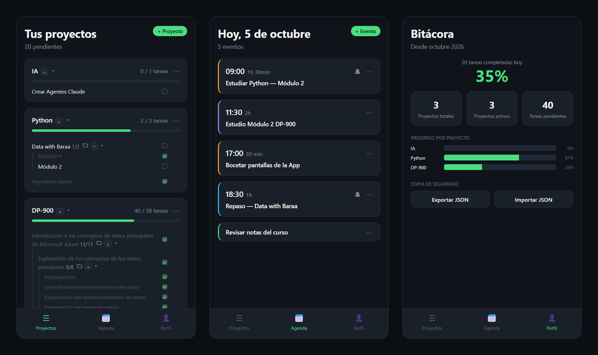
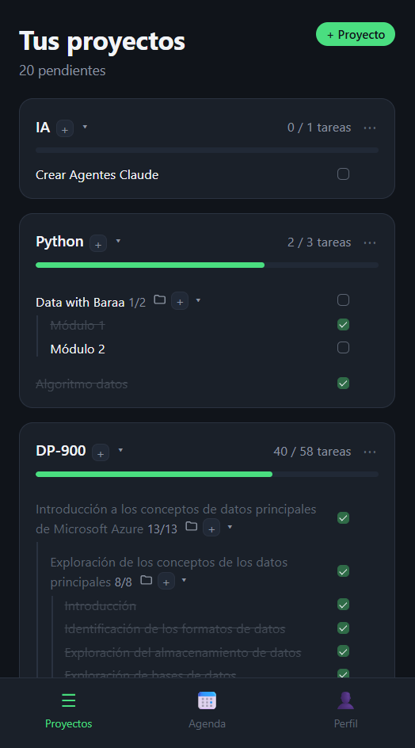
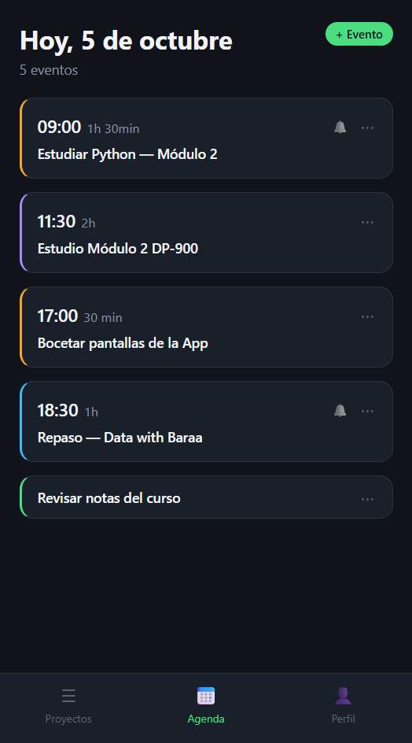
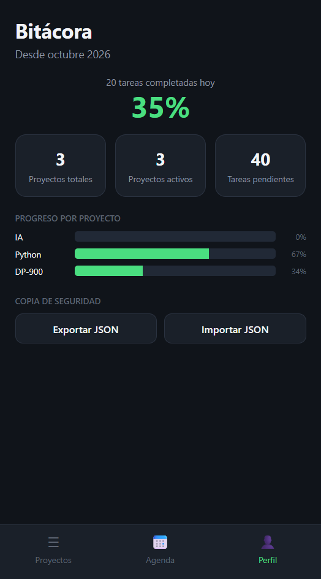

# Bitácora

Aplicación web personal para organizar proyectos y la agenda del día. Está hecha con HTML, CSS y JavaScript puro: sin frameworks, sin dependencias y sin paso de build. Los datos se guardan en el `localStorage` del navegador.



## Qué hace

Tres pantallas, con navegación en la parte inferior.

### Proyectos

- Cada proyecto tiene tareas y carpetas. Las carpetas pueden contener tareas y otras carpetas, sin límite de profundidad. El proyecto de ejemplo DP-900 tiene carpetas dentro de carpetas.
- Barra de progreso por proyecto (`hechas / total tareas`) y contador de pendientes en la cabecera.
- Proyectos y carpetas se pliegan y despliegan. El estado se recuerda al recargar.
- Menú `+` para añadir una tarea o una subcarpeta. Menú `⋯` para editar o borrar.
- Las tareas hechas se tachan y guardan la fecha en que se completaron.



### Agenda

- Eventos del día, con hora o sin hora fija. Se ordenan por hora y los que no tienen hora van al final.
- Cada evento puede llevar duración, un color para el borde y una alarma opcional.
- La cabecera muestra la fecha de hoy y el número de eventos.
- Las alarmas usan las notificaciones del navegador.



### Perfil

- Porcentaje global completado y tareas completadas hoy.
- Proyectos totales, proyectos activos (los que tienen algo dentro) y tareas pendientes.
- Progreso por proyecto.
- "Desde <mes año>": la fecha del primer uso.
- Copia de seguridad: **Exportar JSON** descarga un archivo con todos los datos. **Importar JSON** valida el archivo y pide confirmación antes de cargarlo, porque sustituye todos los datos actuales.



## Cómo se usa

1. En **Proyectos**, pulsa `+ Proyecto` para crear uno. Con el `+` de cada proyecto o carpeta añades tareas o subcarpetas.
2. Marca la casilla de una tarea para darla por hecha. La casilla de una carpeta no se pulsa: se marca sola cuando todas sus tareas están hechas.
3. En **Agenda**, pulsa `+ Evento`. Si marcas "Poner alarma", el navegador te pedirá permiso para mostrar notificaciones.
4. En **Perfil**, exporta de vez en cuando una copia en JSON.

La primera vez la app se abre con proyectos y eventos de ejemplo. Se pueden editar o borrar como cualquier otro, y un proyecto de ejemplo borrado no vuelve a aparecer.

## Cómo ejecutarlo en local

No hay nada que instalar. Clona el repositorio y sirve la carpeta con un servidor estático.

```bash
git clone https://github.com/jorge1sbr/bitacora.git
cd bitacora
```

Opción A: **Live Server** en VS Code. Clic derecho en `index.html` y "Open with Live Server". El repo incluye `.vscode/settings.json` con el puerto 5501, así que la app queda en `http://127.0.0.1:5501`.

Opción B: Python.

```bash
python -m http.server
```

y abre `http://localhost:8000`.

### Por qué no con doble clic

Abrir `index.html` directamente (`file://`) carga la app, pero:

- Las alarmas no funcionan. Con `file://` el navegador no concede permiso para notificaciones, así que la app ni lo pide. En su lugar muestra un aviso en la Agenda (si hay alguna alarma puesta) y en el formulario del evento al activar la alarma.
- El navegador guarda el `localStorage` por separado para cada dirección. `file://`, `http://127.0.0.1:5501` y `http://localhost:8000` tienen datos distintos. Si cambias de una a otra, parecerá que has perdido tus datos. Para moverlos, usa Exportar/Importar JSON.

## Stack

- HTML.
- CSS con variables (`:root`), sin preprocesador.
- JavaScript sin frameworks ni librerías.
- `localStorage` para guardar los datos.
- Web Notifications API para las alarmas.
- File y Blob API para exportar e importar la copia de seguridad.

## Estructura

```
index.html              Estructura de las tres pantallas y los modales (evento y diálogo genérico)
styles.css              Estilos
app.js                  Toda la lógica, por secciones: UTILIDADES, DIÁLOGOS, MENÚS,
                        PROYECTOS, AGENDA, ALARMAS, COPIA DE SEGURIDAD
.vscode/settings.json   Puerto de Live Server (5501)
.claude/agents/         Definiciones de subagentes para Claude Code (interfaz, datos, despliegue y documentación)
```

## Decisiones de diseño

**Se repinta todo desde los datos.** Cada cambio guarda en `localStorage` y llama a `showTodo()`, que ejecuta `showProyectos()`, `showEventos()` y `showPerfil()`. No se toca el DOM a mano para reflejar un cambio: la fuente de verdad son los datos, y la pantalla siempre se genera a partir de ellos.

**Delegación de eventos.** Hay un solo escuchador de clic en `#project-list` para las casillas, el plegado y las opciones del menú `+`, y otro en `document` que abre y cierra todos los menús `⋯` y `+`. Como no se engancha nada a cada elemento, sigue funcionando aunque el HTML de la lista se regenere entero.

**Recursión para las carpetas.** `countTareas`, `findItem`, `buildItemHtml` y `validateItems` se llaman a sí mismas para entrar en carpetas de cualquier profundidad. `removeItem` se apoya en `findItem`, así que también borra a cualquier nivel.

**Diálogos propios.** En lugar de `prompt`, `confirm` y `alert`, `askTexto` y `confirmAccion` abren un modal propio y devuelven una `Promise`. Se usan con `await`:

```js
const nombre = await askTexto({ titulo: 'Nueva carpeta', placeholder: 'Nombre de la carpeta' });
if (nombre === null) return;
```

**Texto del usuario escapado.** Todo lo que escribe el usuario pasa por `escapeHtml` antes de meterse con `innerHTML`. Si alguien escribe `<b>hola</b>` en una tarea, se ve tal cual.

**Datos compatibles hacia atrás.** Las claves originales (`bitacora_projects`, `bitacora_eventos`) se mantienen y lo que ya había guardado sigue funcionando: los campos nuevos, como `fechaCompletada`, son opcionales. Lo que se añadió después va en claves aparte:

| Clave | Para qué |
|---|---|
| `bitacora_desde` | Fecha del primer uso ("Desde <mes año>") |
| `bitacora_plegados` | Ids de proyectos y carpetas plegados |
| `bitacora_semillas` | Ids de proyectos de ejemplo ya añadidos, para que uno borrado no reaparezca |
| `bitacora_alarmas_disparadas` | Alarmas que ya han sonado hoy |

Las tareas antiguas sin `fechaCompletada` siguen funcionando: cuentan como hechas, pero no como "completadas hoy".

**Convención de nombres.** Verbo en inglés y sustantivo en español: `saveProyectos`, `getEventos`, `toggleTarea`, `showPerfil`. Comentarios y textos de la interfaz en español.

### Modelo de datos

```js
// Proyecto (bitacora_projects guarda un array de estos)
{ id, nombre, tareas: [ /* Tarea | Carpeta */ ] }

// Tarea
{ id, tipo: 'tarea', texto, hecha, fechaCompletada? }  // fechaCompletada: ISO, solo si está hecha

// Carpeta
{ id, tipo: 'carpeta', nombre, tareas: [ /* Tarea | Carpeta */ ] }

// Evento (bitacora_eventos guarda un array de estos)
{ id, hora, titulo, duracion, alarma, color }
// hora y alarma: "HH:MM" o null. duracion: texto libre o null.
// color: "#rrggbb" o null (los eventos de ejemplo no lo llevan)
```

Los ids nuevos se generan con `crypto.randomUUID()`.

## Desarrollo con IA

Bitácora se ha desarrollado con Claude como asistente de programación (en el chat y con Claude Code). Una parte importante del código la ha escrito la IA. Las decisiones de producto y de diseño, y la revisión del resultado, son del autor.

- Alcance: aplicación de uso personal para organizar proyectos y agenda, sin cuentas de usuario ni elementos de gamificación.
- Restricciones técnicas: JavaScript sin frameworks ni paso de build, datos en localStorage y coste cero.
- Modelo de datos: proyectos con tareas y carpetas anidadas sin límite de profundidad. Eventos con hora, duración, alarma y color opcionales, y con la alarma independiente de la hora.
- Interfaz: cada pantalla se definió comparando varias propuestas visuales y ajustando la elegida.
- Revisión: cada cambio se probó en el navegador antes de incorporarse al repositorio.

## Limitaciones conocidas

- **Los datos viven en un solo navegador y una sola dirección.** No hay sincronización entre dispositivos. Para hacer copia o llevarlos a otro sitio: Exportar/Importar JSON.
- **Las alarmas solo suenan con la app abierta en una pestaña.** Puede estar en segundo plano, pero no cerrada. Se comprueban cada 30 segundos, con 2 minutos de margen por si el navegador retrasa la comprobación, y cada alarma suena una sola vez al día. No funcionan con `file://` ni en Chrome para Android o Safari en iPhone: para eso harían falta un service worker y notificaciones push.
- **La Agenda es solo "hoy".** Los eventos no tienen fecha, así que aparecen todos los días y su alarma suena cada día.
- **No hay tests automatizados** en el repositorio.
